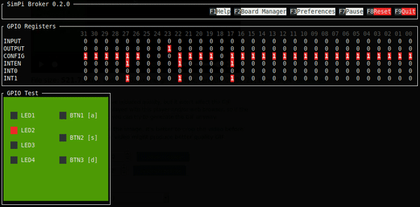

# SimPi 0.2.0
A tool for simulating wiringPi projects written for the Raspberry Pi on
Windows and GNU/Linux.



*NOTE: this project is currently in beta version. Features may not work as
intended or may behave unexpectedly!*

## Features
* Simulates the Raspberry Pi GPIO Register (currently of the 3B+ model)
* Allows you to build and run programs written with the wringPi library
* Supports most of the original library functions (including interrupts)
* Works on GNU/Linux and Windows
* Board Manager
  * Lets you build your own board(s) and display it in the broker
  * Supports LEDs and Buttons for now, see [schemas](docs/schemas/) for more
    information on how to properly config a board

### Planned
* Support of `softPwm.h` library (part of wiringPi)
* Preferences manager
* More detailed wiki (both on GitHub and inside the app)
* Custom themes (big maybe)

## Installation

### From precompiled package
Go to the [releases](https://github.com/patrickgold/simpi/releases) tab and
download the archive of the latest release targeted at your system
(currently only Windows 64bit and Linux 64bit are supported out-of-the-box).
Unpack it, locate the install script within the `simpi` folder and run it.

*Important: If you are on Windows, right click `install.bat` and click "Run as administrator" instead of just double clicking or the installation will fail!*

### From Source (GNU/Linux)
*Prerequisites:*
* gcc compiler
* Rust 1.40.0+ (rustc + cargo)

*Installation process:*
```bash
$ git clone https://github.com/patrickgold/simpi.git
$ cd simpi/
$ chmod +x install.sh
$ ./install.sh
```

### From Source (Windows)
*Prerequisites:*
* Latest Windows 10 recommended
* Visual Studio C++ Compiler
* Rust 1.40.0+ (rustc + cargo)

*Installation process:*

Open the Command Prompt **as Admin**, then
```cmd
> cd %USERPROFILE%\Downloads
> git clone https://github.com/patrickgold/simpi.git
> cd simpi
> install.bat
```

## Usage
Search for "SimPi" in your start menu, there you should find a shortcut to the
SimPi Broker executable.

If there is no shortcut, you can locate the executable in the following folder:
* GNU/Linux: `/opt/simpi`
* Windows: `$programfiles\simpi`

**NOTE:** You should not start the broker in an embedded terminal (e.g. VSCode),
as this emulators often do not implement an raw mode and/or an alternate
screen, which causes the broker to render nothing and thus making it
unusable.

## Compiling Programs

### GNU/Linux
Use the library flag `-lwpisim` of gcc to compile your wiringPi program.
When running the compiled program, it will create/open a shared memory which is
readable/writable for the broker as well. Tip: run your program with
`WPISIM_LOG=1 ./<prog-name>` to see event logs.

### Windows
You need to link the `wpisim.dll.lib` with your wiringPi source code in Visual
Studio C++. Then you need to copy the `wpisim.dll` into the same folder as
the built exe. Then you can run your wiringPi program and it should connect
with the broker.
Note: the dll files are located in the program files folder.

## Used libraries
- [wiringPi](https://github.com/WiringPi/WiringPi)
    by [WiringPi](https://github.com/WiringPi) (Header file `wiringPi.h` only)
- [tui](https://github.com/fdehau/tui-rs)
    by [fdehau](https://github.com/fdehau)
- [shared_memory-rs](https://github.com/elast0ny/shared_memory-rs)
    by [elast0ny](https://github.com/elast0ny)
- [clap](https://github.com/clap-rs/clap)
    by [clap-rs](https://github.com/clap-rs)
- [crossterm](https://github.com/crossterm-rs/crossterm)
    by [crossterm-rs](https://github.com/crossterm-rs)
- (some more, see Cargo.toml files for more info)

## License
This project is licensed under the GNU General Public License v3.0 - see the
[LICENSE](LICENSE) file for details.
